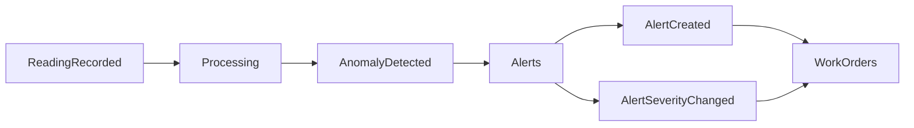

# Plant Spy

Plant Spy is a backend simulation of an industrial monitoring system inspired by real-world platforms.

The project is designed as a **modular monolith with event-driven communication using a pub/sub pattern**, where modules publish events and react to them instead of directly calling each other.

---

## Overview

This system models the lifecycle of industrial monitoring:

- components generate sensor readings
- readings are evaluated for anomalies
- repeated anomalies become alerts
- alerts escalate in severity
- high-severity alerts generate work orders

The goal is to demonstrate:
- event-driven design (without external brokers)
- pub/sub communication between modules
- clear module boundaries

---

## Architecture

Plant Spy follows a **modular monolith + in-memory EventBus** approach.

Each module has a single responsibility:

- **Hierarchy** → structure (locations, assets, components)
- **Readings** → ingestion of sensor data (publishes events)
- **Processing** → anomaly detection (subscribes + publishes)
- **Alerts** → recurrence tracking and alert lifecycle (subscribes + publishes)
- **Work Orders** → operational actions (subscribes)

---

## Event Flow

---

## Next Steps

The current version uses an in-memory EventBus to keep the architecture simple and demonstrate the event-driven flow inside a modular monolith.

Planned improvements:

- Replace the internal EventBus interface with Kafka
- Simulate a higher volume of sensor readings and domain events
- Measure how the system behaves under a larger event load
- Move anomaly processing to Spark for heavier batch or streaming workloads
- Compare the simple in-memory implementation with a more scalable event-processing architecture

The goal is to evolve the project from a local event-driven simulation into a more realistic industrial monitoring pipeline capable of handling larger volumes of readings and alerts.

---

## License

This project is licensed under the MIT License - see the [LICENSE](./LICENSE) file for details.
